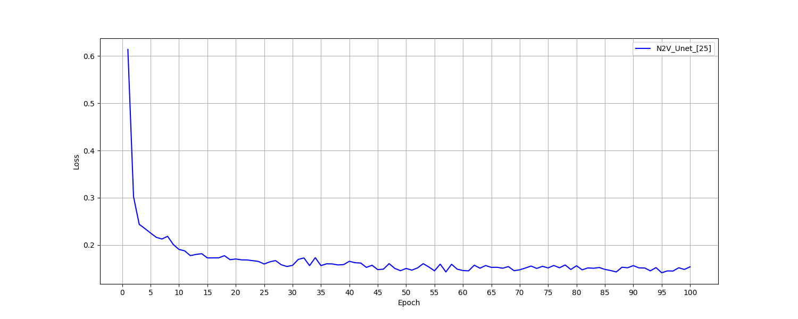

# Noise2Void_jittor
**[English](./README_EN.md) | 简体中文**

   


##  项目简介

本项目是基于自监督图像去噪[Noise2Void- Learning Denoising from Single Noisy Images](https://arxiv.org/abs/1811.10980) 论文和其[TensorFlow代码](https://github.com/juglab/n2v)，提供了Pytorch代码，并转换为 Jittor 框架复现了Noise2Void的训练流程。本项目尤其适合想要了解pytorch迁移jittor以及研究自监督图像处理方向的研究者与学习者。

### Noise2Void
作为一种经典的自监督去噪方法，只需单张含噪图像即可训练网络，假设噪声图像由信号和噪声构成，噪声像素相互独立且均值为零，信号像素不相互独立。基于这些假设，**网络通过学习一个点周围所有点到该点的映射**，由于信号点连续而噪声点非连续，故网络会倾向于输出信号的均值，以此来进行去噪，具有很强的实用性，在Noise2Noise的基础上由成对噪声图像改进为单张噪声图像。


## 任务介绍
-  提供Noise2Void的pytorch框架实现代码，并将其转为jittor框架
-  对比在Unet网络中两种架构的表现
-  记录与可视化两个框架的 loss 曲线、训练性能指标（如 GPU 利用率、显存占用、每轮时间等）
-  总结迁移过程中遇到的问题和经验

## 项目结构

本项目提供的jittor代码完全由Pytorch迁移而来，下方表格展示了两种框架下文件与文件夹一一对应的关系，以及给出了他们的简要说明：

| PyTorch 版本（`Pytorch/`）      | Jittor 版本（`jittor/`）        | 说明 |
|------------------------------------|--------------------------------------|------|
| `main.py`                          | `main.py`                            | 主程序入口，网络训练与验证 |
| `example.py` | `draw_evaluation.py` | 绘制指标曲线 |
| `dataset.py` | `dataset.py` | 封装数据集 |
| `model.py` | `model.py` | 模型实现（Unet..) |
| `utils.py` | `utils.py` | 工具类 |
| `example.py` | `example.py` | 网络测试 |
| `cut68.py` | `cut68.py` | 切割BSD68并生成验证集和测试集 |
| `to_gray` | `to_gray` | 转换灰度图像 |
| `cut.py` | `cut.py` | 切割验证集 |
| `requirements.txt`                | `requirements.txt`                  | 依赖库列表 |
| `dataset/`                       | `dataset/`                         | 去噪后图像结果保存位置 |
| `weights/`      | `functions/`                        | 训练模型保存位置 |
| `worklog/`        | `worklog/`          | 训练日志记录 |
| `Plt/` | `Plt/` | 训练过程指标曲线可视化位置 |

##  环境配置

本项目在以下软硬件环境中完成训练与测试：

### 系统与硬件环境

- 操作系统：Ubuntu 20.04
- Python 版本：3.8
- GPU：NVIDIA RTX 4090（48GB 显存）
- CUDA 驱动：11.8
- CPU：20 vCPU Intel(R) Xeon(R) Platinum 8470Q
- 内存：90 GB。

---


### 安装 Jittor

使用 pip 安装 Jittor：

```bash
sudo apt install python3.7-dev libomp-dev
python3.7 -m pip install jittor
# or install from github(latest version)
# python3.7 -m pip install git+https://github.com/Jittor/jittor.git
python3.7 -m jittor.test.test_example
```

参考：[Jittor 官方安装指南](https://github.com/Jittor/jittor)

---

### 安装依赖库

项目其他依赖已写入 `requirements.txt` 中，可使用如下命令安装：

```bash
pip install -r requirements.txt
```

---

### 环境验证

验证 Jittor 是否成功安装：

```bash
python -c "import jittor as jt; jt.test()"
```

##  数据准备与预处理

- 训练集：使用[BSD500](https://github.com/BIDS/BSDS500)数据集，取其中的400张训练，放在文件夹dataset/BSD400
- 验证集：使用[BSD68](https://gitcode.com/Universal-Tool/51971/?utm_source=article_gitcode_universal&index=top&type=card&&isLogin=1)数据集，取其中的34张用于验证，放在文件夹dataset/BSD68_valid
- 测试集：使用[BSD68](https://gitcode.com/Universal-Tool/51971/?utm_source=article_gitcode_universal&index=top&type=card&&isLogin=1)数据集，取另外的34张用于测试，放在文件夹dataset/BSD400_test

运行`to_gray.py`,将BSD400变为灰度图像。
运行`cut68.py`,调整下载好的BSD68数据集并得到项目所用的验证集和训练集。
运行`cut.py`，切割验证集为64*64的patch和训练集保持一致（`data.py`已完成训练集的自动切割）。

---

## 实现网络

该Unet网络是根据 Noise2Void 论文中提出的架构进行复现的。它的编码器 - 解码器结构、跳跃连接等设计特点，能有效提取不同尺度特征，在处理复杂图像数据时展现出强大的性能。

1. **核心架构**：由左侧编码器、右侧解码器及跳跃连接三部分组成，适用于灰度图像处理（输入输出以 1 通道为例）。

2. **编码器（左侧）**：
   - 通过 5 个 Block 逐步压缩空间维度、提取高层特征
   - Block 1 含 2 次卷积 + ReLU + 最大池化，输出 48 通道
   - 后续 4 个 Block 2 各含 1 次卷积 + ReLU + 最大池化，保持 48 通道
   
3. **解码器（右侧）**：
   
   - 通过转置卷积（上采样）逐步恢复空间维度
   - 包含 Block 3-6，通过多次卷积与上采样操作处理特征
   - 最终通过 Block 6 的 3 次卷积输出 1 通道结果
   
4. **跳跃连接**：采用特征拼接（Concat）方式，将编码器对应层级的特征（48 通道）与解码器上采样特征融合，补充细节信息，解决下采样导致的信息丢失问题。

5. **通道变化**：编码器保持 48 通道，解码器通过拼接操作形成 96/144 通道特征，最终通过卷积压缩至 1 通道输出，兼顾特征提取与细节保留，适用于图像去噪、分割等像素级任务。

   <div align="center">
     
     <p><i>Unet网络架构</i></p>
   </div>
---

## 实验流程

环境配置完成后，即可使用如下命令启动模型的训练过程：

```bash
python main.py --arch "N2V_Unet" \  # REDNet10, REDNet20, REDNet30               
               --images_dir "" \
               --outputs_dir "" \
               --gaussian_noise_level 25 \
               --clean_valid_dir\
               --patch_size 64 \
               --batch_size 16 \
               --num_epochs 100 \
               --lr 1e-4 \
               --threads 8          
```

请根据具体情况修改参数，其中：

- `{arch}`：使用网络（如 `N2V_Unet`、`REDNet10`）；
- `{images_dir}`：训练集路径；
- `{clean_valid_dir}`：验证集路径；
- `{outputs_dir}`：保存权重路径；
- `{gaussian_noise_level}`：设置高斯噪声等级；
- `{patch_size}`：指定patch大小；
- `{batch_size}`：指定批次大小；
- `{num_epochs}`：指定训练轮数；
- `{lr}`：指定学习率；
- `{threads}`：指定线程数；


模型训练完成后，使用如下命令启动模型的测试过程：

```bash
python example.py --arch "REDNet30" \  # REDNet10, REDNet20, REDNet30
                  --weights_path "" \
                  --image_path "" \
                  --outputs_dir "" \
                  --gaussian_noise_level 10     
```

- `{arch}`：使用的网络；
- `{weights_path}`：指定权重路径；
- `{image_path}`：指定测试集路径；
- `{outputs_dir}`：设置去噪图片输出目录；
- `{gaussian_noise_level}`：高斯噪声等级；

---

### 日志记录说明

训练过程中每个 epoch 会自动记录以下信息并输出到终端与日志文件中：

- 运行时间；
- 当前 epoch；
- 当前 epoch 对应的 loss 值以及在验证集上的PSNR值，SSIM值；
- 当前 epoch的执行时间（单位：秒）；

日志将以log文件形式自动保存在 `worklog/` 目录下。

---

### 日志片段示例

```text
2025-08-09 13:23:43,803 - INFO - Epoch 1/100, Loss: 0.717217, PSNR: 6.83, SSIM: 0.1065, Time: 3.99s
2025-08-09 13:23:49,645 - INFO - Epoch 2/100, Loss: 0.378051, PSNR: 9.60, SSIM: 0.1768, Time: 3.33s
2025-08-09 13:23:55,507 - INFO - Epoch 3/100, Loss: 0.301817, PSNR: 11.57, SSIM: 0.2086, Time: 3.31s
2025-08-09 13:24:01,228 - INFO - Epoch 4/100, Loss: 0.292940, PSNR: 11.37, SSIM: 0.2564, Time: 3.23s
2025-08-09 13:24:06,611 - INFO - Epoch 5/100, Loss: 0.284868, PSNR: 11.87, SSIM: 0.2449, Time: 2.89s
...
```

---

## 实验结果

- **使用Unet网络分别添加 σ = 10、25、30、50的高斯噪声，测试集的平均PSNR,SSIM如下**


由数据可以得出，Jittor框架下的图像去噪效果与Pytorch效果不相上下，甚至在一些情况下要明显好于Pytorch.

其中一结果如图，每一列分别为原图像，加噪后的图像，jittor框架去噪图像，pytorch框架去噪图像


σ = 10                                                                                                                        **jittor**                                                **pytorch**

 σ = 25.jpeg)σ = 30.jpeg)

σ = 50
.jpg)

---

## 框架对齐与性能对比

为对比两种框架下的训练情况，我在其他条件相同的情况下训练并使用 TensorBoard/matplotlib 对训练过程进行可视化分析。

- 数据集：BSD400

- Batch Size：64

- 训练轮数：100 Epochs

- 线程数：8

- 高斯噪声：σ = 25

- 网络：Unet

  

---

### 训练指标指标对齐

<div align="center">
  
  <p><i>PyTorch 训练 loss 曲线,</i></p>


<div align="center">
  
  <p><i>Jittor 训练 loss 曲线</i></p>
</div>
由图可得，两个曲线的走向**几乎一致**，前期都快速下降，后续趋于平稳，最终都达到0.15左右，故在当前实验设置（相同网络、数据、优化策略等 ）下，PyTorch 和 Jittor 训练时模型均有效学习，**表明 Jittor 可在该场景中较好复现 PyTorch 的训练效果**，初步验证其对 PyTorch 框架训练表现的适配性。

<div align="center">
  
  <p><i>PyTorch验证集PSNR,SSIM曲线</i></p>

<div align="center">
  
  <p><i>Jittor验证集PSNR,SSIM曲线</i></p>
</div>

PSNR和SSIM两条曲线在两者的整体趋势高度相似，说明 Jittor 能较好适配该模型训练逻辑，在验证集评估指标上复现 PyTorch 的训练效果。另外我发现与pytorch曲线相比 在jittor框架下 ，**PSNR 和 SSIM 波动更明显**，这反映出框架在计算细节存在区别。可能是因为jittor具有自动微分、计算图优化等独特功能。

---

### 单轮训练时长

<div align="center">
  
  <p><i>PyTorch 单轮训练耗时</i></p>


<div align="center">
  
  <p><i>jittor 单轮训练耗时</i></p>

两者前期都快速下降，但后期PyTorch 更稳定，但耗时更高（~4.8s/epoch）。jittor后期波动大，但平均耗时显著低于pytorch，**具有更高的效率**。这是因为其提前编译计算图，融合了底层算子。其动态的优化策略可能导致耗时的波动。

---

### 显存占用

<div align="center">
  
  <p><i>PyTorch 显存使用</i></p>


<div align="center">
  
  <p><i>jittor 显存使用</i></p>

PyTorch 显存使用峰值约 761MiB ，占用低且稳定。Jittor 显存使用峰值约 1783MiB ，**占用明显更高**。这可能因为jittor的计算图、算子实现等，这些数据占用了更多的显存换取了更高的训练效率。


---

### GPU 利用率

<div align="center">
  
  <p><i>PyTorch GPU 利用率</i></p>


  <div align="center">
  
      <p><i>Jittor GPU 利用率</i></p>

PyTorch 曲线呈现间歇性的高 - 低波动，而jittor曲线是密集高频波动，整体维持高利用率。

**总的来说，从训练时的loss、PSNR、SSIM来看，两者结果基本一致，与pytorch相比，jittorGPU利用率波动密集，占用显存更大，每轮训练时间不稳定，但平均更短效率更高。由此可得，jittor可以很好地复现本次任务的pytorch结果，甚至在一些方面更优**。


---
## 总结

以下我将列出我在该项目中总结的问题和经验，供各位参考。

1. 首先是环境的搭建，刚开始我通过Docker安装jittor，但训练时我发现我笔记本电脑的显卡性能过低，便在Autodl算力云上租RTX4090进行训练。在租用示例时我发现他提供jittor的基础镜像，但是仅提供1.3.1版本的jittor和3.8版本的python。创建成功后，运行jittor框架报错，原因是Jittor检测到的CUDA设备架构为sm_120（可能是误识别或虚拟环境问题），但CUDA 11.3不支持该架构，所以需要升级cuda,即jittor框架与cuda版本不匹配问题。最简单的解决方法是不直接使用jittor的虚拟镜像，使用其他镜像之后再安装上jittor即可运行jittor框架。
2. 接下来说一下jittor和pytorch代码的几点区别，pytorch的网络实在nn.Module的基础上搭建的，而jittor是在`jt.Module`搭建的。pytorch的网络类中实现了`forward()`而jittor则用`execute()`来代替，同时jittor没有`backward()`函数，而是融合到了step函数中。jittor使用统一的内存管理，即统一GPU和CPU内存,耗尽GPU后会用CPU来弥补，故不需要代码中加入`to(device)`的声明，直接再开头加上`jt.flags.use_cuda =  0，1`来设置是运行在GPU模式还是CPU模式。在torch中，`view()`等几个函数并不生成新的数据，只是改变了数据的索引方式，因此其存储是不连续的，有时候需要用`contiguous()`函数使数据变得一致，但jittor中并没有这个函数。
3. 官方提供了一个简单的Pytorch模型代码转Jittor模型的[脚本](https://cg.cs.tsinghua.edu.cn/jittor/pt_converter/)，但必须是class+module声明的类才能转换，对于其他部分都需要自己转换，需要注意pytorch中具有的函数在jittor中大多具有同名函数，直接将torch改为jittor就能用，但是有些函数即使函数名称和功能都一样但是设置的参数不同，需要注意，其他jittor中没有相同名称函数则需要在[官方使用文档](https://cg.cs.tsinghua.edu.cn/jittor/assets/docs/index.html)中查找，都有对应作用的函数。

本次项目是我第一次深入了解并使用jittor框架，故迁移过程中遇到了许多环境或技术上的问题，但最终都能一一解决，收获颇丰。但我仍对jittor框架的理解不够透彻，今后会做更多的深入探究。总的来说，从项目最终的结果来看，pytorch的运行结果都能在jittor框架下成功复现，且某些方面jittor更优。目前pytorch拥有庞大且活跃的社区，在学术界占据主导地位，但随着jittor的不断发展和推广，相信他的应用场景也将不断扩展。
